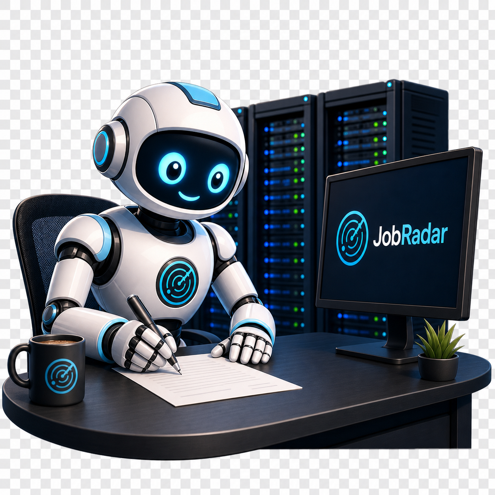

# 🎯 JobRadar

<p align="center">
  
</p>

<p align="center">
  <strong>Dein persönlicher KI-Bewerbungsassistent</strong><br/>
  Mit 7 Jobquellen, KI-Anschreiben und vollständigem Bewerbungs-Tracking.
</p>

<p align="center">
  
  
  
  
  
</p>

---

## ✨ Features

### 🔍 Stellensuche
- **7 Quellen gleichzeitig**: Arbeitnow, Jobicy, Arbeitsagentur, The Muse, Remotive, Adzuna, Jooble
- Automatischer **Match-Score** basierend auf deinen Keywords und Blacklist
- **Dublettencheck** — bereits beworbene Stellen werden direkt markiert
- Quellen einzeln oder alle zusammen durchsuchbar

### 🤖 KI-Anschreiben via Ollama
- **Vollständig lokal** — keine Cloud, keine Kosten, keine Datenweitergabe
- Schickt Stellentitel, Firma, Tags, Beschreibung und dein Profil als Kontext
- **Modell-Auswahl** direkt in der UI (alle lokal installierten Modelle)
- **KI-Feedback**: Bewertung 1–10 mit Verbesserungsvorschlägen
- Mehrere **Anschreiben-Vorlagen** verwaltbar
- PDF-Export, E-Mail-Button, Kopieren

### 📋 Bewerbungs-Tracking
- **SQLite-Datenbank** — Daten bleiben dauerhaft erhalten
- Status-Badges: Beworben / Interview / Angenommen / Abgelehnt
- **Kommentar-Zeitstrahl** pro Bewerbung (Statuswechsel automatisch eingetragen)
- Inline-Editor für Notizen, Follow-up-Datum und Sterne-Bewertung
- Follow-up-Erinnerungen: 🔴 überfällig / 🟡 fällig bald
- Filter nach Status, Firma, aktiv/archiviert
- **CSV-Export**

### 📊 Dashboard
- 5 Kennzahlen-Kacheln: Gesamt, Überfällig, Interview, Angenommen, Abgelehnt
- Status-Log mit Zeitstempel
- Automatisches Nachladen alle 5 Minuten

### ⚙️ Technik
- **PWA** — als Desktop-App installierbar, offline-fähig
- Dark / Light Mode mit automatischer System-Erkennung
- Browser-Notifications für fällige Follow-ups
- Docker Compose — ein Befehl zum Starten
- Vollständig responsiv

---

## 🚀 Installation

### Voraussetzungen
- [Node.js](https://nodejs.org) 18+
- [Ollama](https://ollama.com) lokal installiert und laufend
- Optional: Docker & Docker Compose

### Option A — Direkt starten

```bash
git clone https://github.com/freddykrueger88/JobRadar.git
cd JobRadar
npm install
cp .env.example .env
npm start
```

Dann im Browser öffnen: **http://localhost:3000**

### Option B — Docker Compose

```bash
git clone https://github.com/freddykrueger88/JobRadar.git
cd JobRadar
cp .env.example .env
docker compose up -d
```

---

## ⚙️ Konfiguration (.env)

```env
PORT=3000
DB_PATH=./data/bewerbungen.sqlite

# Ollama KI (lokal) — IP/Host deiner Ollama-Instanz eintragen
OLLAMA_URL=http://localhost:11434
OLLAMA_MODEL=mistral

# Adzuna (kostenlos — https://developer.adzuna.com)
ADZUNA_APP_ID=
ADZUNA_APP_KEY=

# Jooble (kostenlos — https://jooble.org/api/about)
JOOBLE_API_KEY=
```

---

## 🤖 Ollama Modell installieren

```bash
# Empfohlen für Anschreiben auf Deutsch
ollama pull mistral

# Alternativ: kleiner und schneller
ollama pull llama3.2

# Prüfen ob Modell läuft
curl http://localhost:11434/api/tags
```

### 🏆 Warum Mistral das empfohlene Modell ist

Für das Schreiben von Bewerbungsanschreiben auf Deutsch ist **Mistral 7B** die beste Wahl unter allen lokal ausführbaren Modellen:

| Kriterium | Mistral 7B | Llama 3.2 (3B) | Phi-4 (14B) |
|---|---|---|---|
| **Deutsch** | ✅ Sehr gut | ⚠️ Mittelmäßig | ✅ Sehr gut |
| **Formeller Stil** | ✅ Natürlich, präzise | ⚠️ Manchmal locker | ✅ Exzellent |
| **Größe** | ✅ ~4 GB | ✅ ~2 GB | ⚠️ ~9 GB |
| **Geschwindigkeit** | ✅ Schnell | ✅ Sehr schnell | ⚠️ Langsamer |
| **RAM-Bedarf** | ✅ Ab 8 GB RAM | ✅ Ab 4 GB RAM | ⚠️ Ab 16 GB RAM |
| **Anweisungen folgen** | ✅ Zuverlässig | ⚠️ Gelegentlich abweichend | ✅ Sehr zuverlässig |

Mistral trifft den perfekten Mittelweg: Es ist **klein genug** um auf fast jedem Rechner flüssig zu laufen, aber **intelligent genug** um formelles Deutsch mit dem richtigen Ton für Bewerbungsanschreiben zu produzieren.

> **Tipp:** Wer mehr als 16 GB RAM hat, kann `phi4` ausprobieren — die Qualität ist noch etwas besser, braucht aber deutlich mehr Ressourcen.

---

## 📁 Projektstruktur

```
JobRadar/
├── public/          # Frontend (HTML, CSS, JS, PWA)
│   ├── index.html
│   ├── logo.png
│   ├── css/style.css
│   ├── js/app.js
│   ├── manifest.json
│   └── sw.js
├── src/
│   ├── index.js     # Express-Server
│   ├── db/          # SQLite-Datenbank
│   └── routes/      # API-Routen
│       ├── bewerbungen.js
│       ├── ki.js    # Ollama-Integration
│       ├── suche.js # 7 Jobquellen
│       ├── vorlagen.js
│       └── profil.js
├── docker-compose.yml
├── Dockerfile
└── .env.example
```

---

## 📜 Lizenz

MIT — frei verwendbar, anpassbar und erweiterbar.
